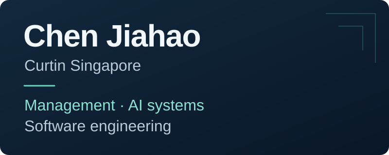

Management student at **Curtin Singapore**, learning about AI systems and software engineering.

## Learning focus

| Area | Direction |
| --- | --- |
| AI systems | Understanding how AI systems are designed and evaluated. |
| Software engineering | Learning the foundations of software design, testing, and maintenance. |

管理学在读，持续学习 AI 系统与软件工程。
